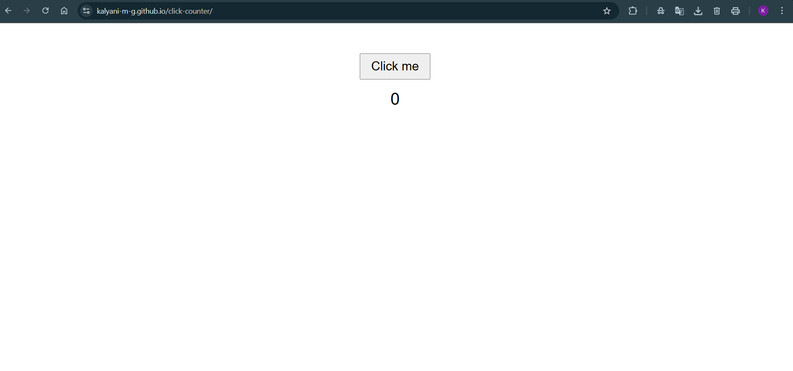

 Screenshot

# Click Counter

A super‑simple web app that tracks how many times you click a button.  
Built with plain HTML, CSS, and JavaScript.

 Quick Overview

A single page with a button and a live count display. Click the button, the number increments instantly without reload.

 Repo Files

index.html — the app  
README.md — this file  
screenshots

 Known Limitations

- Count resets on page reload  
- No reset or decrement functionality built‑in

